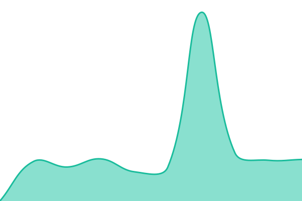

# [📈 Status ao vivo](https://status.vctgomes.com): <!--live status--> **🟨 Degraded performance**

This repository contains the open-source uptime monitor and status page for [VCTGomes](https://status.vctgomes.com), powered by [Upptime](https://github.com/upptime/upptime).

With [Upptime](https://upptime.js.org), you can get your own unlimited and free uptime monitor and status page, powered entirely by a GitHub repository. We use [Issues](https://github.com/SEU_USUARIO_GITHUB/vct-status/issues) as incident reports, [Actions](https://github.com/SEU_USUARIO_GITHUB/vct-status/actions) as uptime monitors, and [Pages](https://status.vctgomes.com) for the status page.

## [📈 Live Status](https://demo.upptime.js.org): <!--live status--> **🟨 Degraded performance**

<!--start: status pages-->
<!-- This summary is generated by Upptime (https://github.com/upptime/upptime) -->
<!-- Do not edit this manually, your changes will be overwritten -->
<!-- prettier-ignore -->
| URL | Status | History | Tempo de resposta | Disponibilidade |
| --- | ------ | ------- | ------------- | ------ |
|  [RMF](https://redesmoveisfixas.com/health) | no ar | [rmf.yml](https://github.com/VCTGomes/vct-status/commits/HEAD/history/rmf.yml) | 

 546ms
     
 | 

<a href="https://status.vctgomes.com/history/rmf">100.00%</a>
    

|  [RMF API](https://api.redesmoveisfixas.com/health) | no ar | [rmf-api.yml](https://github.com/VCTGomes/vct-status/commits/HEAD/history/rmf-api.yml) | 

 519ms
     
 | 

<a href="https://status.vctgomes.com/history/rmf-api">100.00%</a>
    

|  [RMF AI](https://ai.redesmoveisfixas.com/health) | no ar | [rmf-ai.yml](https://github.com/VCTGomes/vct-status/commits/HEAD/history/rmf-ai.yml) | 

 517ms
     
 | 

<a href="https://status.vctgomes.com/history/rmf-ai">100.00%</a>
    

|  [Bot Telegram (RMF)](https://ai.redesmoveisfixas.com/health) | no ar | [bot-telegram-rmf.yml](https://github.com/VCTGomes/vct-status/commits/HEAD/history/bot-telegram-rmf.yml) | 

 470ms
     
 | 

<a href="https://status.vctgomes.com/history/bot-telegram-rmf">100.00%</a>
    

|  [Malha Brasil](https://malhabrasil.com/health) | degradado | [malha-brasil.yml](https://github.com/VCTGomes/vct-status/commits/HEAD/history/malha-brasil.yml) | 

 808ms
     
 | 

<a href="https://status.vctgomes.com/history/malha-brasil">99.99%</a>
    

|  [Malha Brasil AI](https://ai.malhabrasil.com/health) | degradado | [malha-brasil-ai.yml](https://github.com/VCTGomes/vct-status/commits/HEAD/history/malha-brasil-ai.yml) | 

 1284ms
     
 | 

<a href="https://status.vctgomes.com/history/malha-brasil-ai">99.99%</a>
    

|  [Tiles CDN (principal)](https://cdn.redesmoveisfixas.com/health) | no ar | [cdn-tiles.yml](https://github.com/VCTGomes/vct-status/commits/HEAD/history/cdn-tiles.yml) | 

 193ms
     
 | 

<a href="https://status.vctgomes.com/history/cdn-tiles">100.00%</a>
    

|  [Tiles local (backup)](https://tiles-health.redesmoveisfixas.com/health) | no ar | [tiles-rmf-e-malha-brasil.yml](https://github.com/VCTGomes/vct-status/commits/HEAD/history/tiles-rmf-e-malha-brasil.yml) | 

 509ms
     
 | 

<a href="https://status.vctgomes.com/history/tiles-rmf-e-malha-brasil">100.00%</a>
    

<!--end: status pages-->

[**Visit our status website →**](https://status.vctgomes.com)

## 📄 License

- Powered by: [Upptime](https://github.com/upptime/upptime)
- Code: [MIT](./LICENSE) © [Anand Chowdhary](https://anandchowdhary.com)
- Data in the `./history` directory: [Open Database License](https://opendatacommons.org/licenses/odbl/1-0/)
